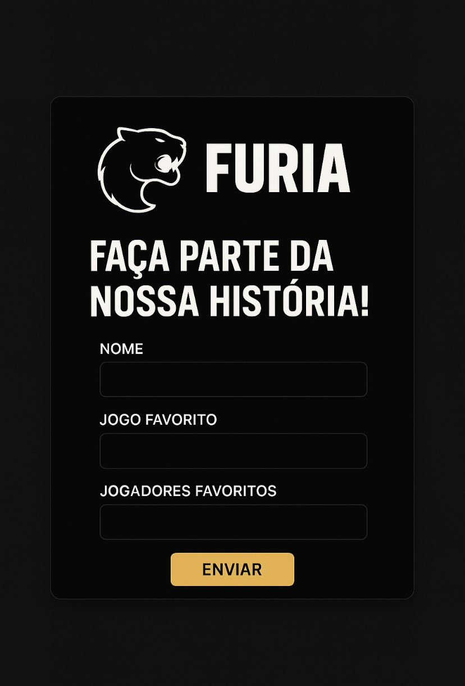

# insights-da-furia
Projeto criado para o desafio técnico "Know Your Fan" da FURIA Tech — uma solução para entender melhor os fãs da organização.
# Know Your Fan – FURIA Tech

Este projeto foi desenvolvido como parte do desafio técnico da FURIA para a vaga de Assistente de Engenharia de Software.

## 🎯 Objetivo

Criar uma solução que ajude a FURIA a conhecer melhor seus fãs, entendendo seus gostos, hábitos e preferências — permitindo uma conexão mais próxima e personalizada entre a organização e sua comunidade.

## 🛠️ Ferramentas utilizadas

- **Tally.so** – Para criação do formulário interativo
- **Canva** – Para criação do protótipo visual do site
- **ChatGPT** – Apoio no desenvolvimento e estruturação das ideias
- **GitHub** – Para versionamento e documentação do projeto

## 👨‍💻 Sobre mim

Meu nome é Renan, sou estudante de Ciência da Computação e estou iniciando minha jornada em programação com foco em C#. Também estou estudando Python, Java e C, além de ter experiência em montagem de computadores.

Sou apaixonado por tecnologia, games e principalmente pelos times da FURIA — especialmente nas modalidades de CS, LoL e Valorant.  

## 📹 Apresentação em vídeo

Assista ao vídeo de apresentação do projeto e da minha participação:

🔗 [Vídeo no YouTube](https://youtube.com/shorts/AbmQRu1UqGU)

## 🖼️ Protótipo visual

Visualização de como essa solução poderia ser aplicada no site da FURIA:

## 📋 Formulário interativo

🔗 [Formulário no Tally](https://tally.so/r/wQjdp7)

## ✨ Pitch do Projeto

O objetivo desse projeto é aproximar a FURIA da sua comunidade por meio de um formulário interativo simples e intuitivo, capaz de coletar informações sobre os fãs — como seus jogos favoritos, jogadores preferidos e interesse em produtos da organização.

Com esses dados, a FURIA pode personalizar ações de marketing, criar campanhas direcionadas e promover uma experiência ainda mais única para seus torcedores.

---

Feito com muito carinho por um verdadeiro FURIOSO 💜🖤
